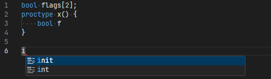
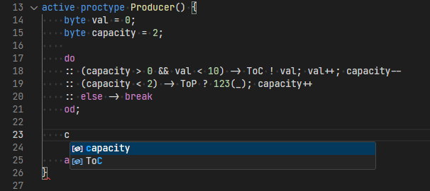

# Promela LSP Extension

## Overview

This extension provides basic syntax validation and code completion for the Promela
language. Provided support is limited but mostly functional.
Results can be seen in the pictures below:

Additionally, the parsed grammar of example source files is visualized as a tree in the `images` folder.

## Running

- Run `npm install` in this folder. This installs all necessary npm modules in both the client and server folder
- Open VS Code on this folder.
- Press Ctrl+Shift+B to start compiling the client and server in [watch mode](https://code.visualstudio.com/docs/editor/tasks#:~:text=The%20first%20entry%20executes,the%20HelloWorld.js%20file.).
- Switch to the Run and Debug View in the Sidebar (Ctrl+Shift+D).
- Select `Launch Client` from the drop down (if it is not already).
- Press ▷ to run the launch config (F5).
- Open a `.pml` file and start coding.

## Sources

The base structure of the project is based on an example from the
[official LSP guide](https://code.visualstudio.com/api/language-extensions/language-server-extension-guide)
. Some examples were also borrowed from
[this Antlr tutorial](https://tomassetti.me/code-completion-with-antlr4-c3/)
and [this GitHub repository](https://github.com/mike-lischke/antlr4-c3).
